# HBS AI Institute — Multi-Agent Content Command Center

A hierarchical **hub-and-spoke** multi-agent system built for production use
by the Instructional Designer & AI Product Manager at the HBS AI Institute.
One executive interface (the **Chief of Staff**) routes every request to
specialized **Directors**, enforces cost and approval guardrails, and
persists organizational memory across sessions.

---

## 0. Operating modes — read this first

This system runs two genuinely different ways, sharing the same config,
memory, and pipeline files. **Interactive is the current, default mode.**

| | **Interactive** (default, current) | **Unattended** (built, disabled) |
|---|---|---|
| Who's the Chief of Staff? | This live Claude Code chat session — Claude reads `config.yaml` as its operating contract and acts as the hub directly in conversation | `agents/chief_of_staff.py`, run via `python main.py` |
| Runs when you're not here? | No — never | Yes, if enabled (cron, GitHub Actions, etc.) |
| Approvals | You're asked in the conversation, live, every time | Blocks on stdin `input()`, or auto-denies in `--unattended` mode |
| Connector access (Lovable, ElevenLabs, Granola, Notion) | Yes — Claude calls them directly | No — no unattended path exists for connector-only integrations |
| How to turn it on | It's always on — just talk to your Chief of Staff | Off by default. `config.yaml`'s `operating_mode.unattended.enabled: false` — you flip that flag deliberately, nothing else can |

**You don't have to choose between them.** Keep talking to your Chief of
Staff here for everything, and if a specific request is genuinely worth
running unattended later, say so — the Chief of Staff logs it with
`PipelineTracker.queue_unattended_request()` (status: *"Queued — awaiting
unattended mode enablement"*) and executes nothing until you explicitly
turn that mode on.

### Connector-driven Directors

Four integrations are chat-connector-only — they have **no API key / `.env`
path** at all, because personal accounts don't expose a public REST API for
them (Granola) or because the natural way to use them is Claude acting live
on your behalf (Lovable, ElevenLabs):

| Connector | Status | What it changes |
|---|---|---|
| **Granola** | ✅ connected | Pedagogical Synthesis Director / Memory Curator can ingest a real meeting transcript via `MemoryCurator.ingest_external_transcript()` instead of you pasting notes in by hand |
| **Lovable** | ✅ connected | UI/UX Architecture Director can send a build to Lovable directly instead of only handing you a spec |
| **ElevenLabs** | ✅ connected | Multimedia Production Director can generate real audio/voice instead of only a production spec |
| **Notion** | ⚠️ installed, not yet connected | Finish connecting it in your chat's connector settings for live in-chat search/write; the `.env`-based unattended path (`NOTION_API_KEY`) still works independently |

**Connected is not the same as free.** Every Lovable `send_message` /
`create_project` call spends Lovable workspace credits; every ElevenLabs
generation spends free-tier character quota. These go through the same
`cost_bearing_action` HITL checkpoint as everything else — every single
call, not just the first one. See §4.

### KH HBS Agentic Workforce — a web front end

**[KH HBS Agentic Workforce](https://claude.ai/code/artifact/e2a1d047-54f9-42c4-bdcc-19d3d3c26594)**
is a published, HBS-branded, chat-first dashboard: talk (type or speak) to
Eliot in a sidebar-navigated app, see which Director(s) he routed your
request to and why, and browse their saved output by category — Market
Intelligence, Course Drafts, PRDs & GitHub Sync, Pipeline Tracker,
Analytics — with Approve / Needs Revision / Delete on everything. Source
in `web/workforce.html`; see `web/README.md` for exactly what it can and
can't do — it's an attended, chat-adjacent tool, not a second execution
path.

---

## 1. Architecture at a glance

```mermaid
flowchart TB
    U["👤 You<br/>(sole human interface)"] --> COS

    subgraph HUB["THE HUB"]
        COS["🧭 Chief of Staff<br/>Intelligent Router"]
        MC["🧠 Memory Curator<br/>persistent context engine"]
        COS <--> MC
    end

    COS -->|"parallel dispatch"| D1
    COS -->|"parallel dispatch"| D2
    COS -->|"parallel dispatch"| D3
    COS -->|"parallel dispatch"| D4
    COS -->|"parallel dispatch"| D5
    COS -->|"parallel dispatch"| D6
    COS -->|"parallel dispatch"| D7
    COS -->|"parallel dispatch"| D8
    COS -->|"parallel dispatch"| D9

    D1["📈 Market &<br/>Executive Intelligence"] -.->|"output ONLY<br/>back to hub"| COS
    D2["🎓 Pedagogical Synthesis<br/>& Instructional Design"] -.-> COS
    D3["🛠️ AI Product Mgmt<br/>& Development"] -.-> COS
    D4["📋 Project Mgmt &<br/>Cross-Functional Ops"] -.-> COS
    D5["🎨 Interactive UI/UX<br/>Architecture"] -.-> COS
    D6["📣 Growth &<br/>Omnichannel Content"] -.-> COS
    D7["🎬 Multimedia<br/>Production"] -.-> COS
    D8["📊 Analytics &<br/>Leadership Reporting"] -.-> COS
    D9["♿ Accessibility &<br/>Compliance"] -.-> COS

    MC <-->|"sync"| GH[("GitHub")]
    MC <-->|"sync"| NO[("Notion")]
    D4 <-->|"sync"| AT[("Airtable")]

    COS -->|"strategic / pedagogical /<br/>cost / publish checkpoints"| HITL{{"🛑 Human-in-the-Loop<br/>Checkpoint"}}
    HITL --> U

    style HUB fill:#1a1a2e,stroke:#e94560,color:#fff
    style COS fill:#e94560,stroke:#fff,color:#fff
    style MC fill:#0f3460,stroke:#fff,color:#fff
    style HITL fill:#f39c12,stroke:#333,color:#000
```



### ASCII fallback (for terminals / plain-text decks)

```
                                   ┌───────────────────────┐
                                   │          YOU           │
                                   │ (sole human interface) │
                                   └───────────┬─────────────┘
                                               │
                                               ▼
                        ┌──────────────────────────────────────────┐
                        │                  THE HUB                  │
                        │  ┌────────────────┐   ┌──────────────┐   │
                        │  │ Chief of Staff  │◄─►│Memory Curator│   │
                        │  │Intelligent Router│   │(core pillar) │   │
                        │  └────────┬─────────┘   └──────┬───────┘   │
                        └───────────┼──────────────────────┼─────────┘
                                    │  parallel dispatch    │ sync
              ┌─────────────────────┼─────────────────────┐ │
              ▼          ▼          ▼          ▼           ▼ ▼
        ┌─────────┐┌─────────┐┌─────────┐┌─────────┐  ┌────────┐┌────────┐
        │ Market  ││Pedagog. ││ Product ││ Project │  │ GitHub ││ Notion │
        │ Intel   ││Synthesis││   Mgmt  ││   Mgmt  │  └────────┘└────────┘
        └────┬────┘└────┬────┘└────┬────┘└────┬────┘
              (+ UI/UX, Growth, Multimedia, Analytics, Accessibility — 9 total)
              │          │          │          │
              └──────────┴────┬─────┴──────────┘
                    outputs return ONLY to the Chief of Staff
                               │
                               ▼
                    ┌────────────────────┐
                    │  Synthesized, HITL- │
                    │  gated final answer │──► YOU
                    └────────────────────┘
```

**The one rule that defines this architecture:** Directors never talk to
each other. Each one works in parallel inside its own domain and hands its
polished output back only to the Chief of Staff, which synthesizes
everything into a single unified response.

---

## 2. The Hub

Every hub-and-spoke role carries a real Harvard namesake alongside its
functional title — chosen to fit the role, never merely decorative, and
never a contested or living figure. The two hub roles take **University**-wide
figures (they coordinate across everything below them); the ten Directors
take **HBS**-specific figures (each owns one bounded domain). See
`config.yaml`'s `naming_convention` for the full rationale.

| Component | Namesake | Role |
|---|---|---|
| **Eliot** — Chief of Staff (`agents/chief_of_staff.py`) | Charles William Eliot, Harvard's longest-serving president (1869–1909) — built the coordinating structure across Harvard's schools | Your sole interface. Classifies every request (Intelligent Router), queries the Memory Curator, dispatches to matched Directors in parallel, gates results through HITL checkpoints, synthesizes the final answer. |
| **Winsor** — Memory Curator (`agents/memory_curator.py`) | Justin Winsor, Harvard's University Librarian (1877–1897), a founder of American librarianship | Runs alongside the hub as a persistent context engine. Curates every exchange into structured long-term memory, serves `recall()` to inform future routing, and syncs to GitHub + Notion. |

### How memory curation works

1. Every request first calls `MemoryCurator.recall()` — a keyword-overlap
   search over `memory/long_term/knowledge_base.jsonl` — so the Chief of
   Staff and Directors have prior context before they act.
2. Every completed exchange is handed to `MemoryCurator.remember()`, which:
   - Appends the raw turn to `memory/session_logs/<date>.jsonl` (audit trail).
   - Appends a curated record to `memory/long_term/knowledge_base.jsonl`.
   - Pushes that file to **GitHub** (`database_sync/github_sync.py` — uses
     the GitHub API if `GITHUB_TOKEN`/`GITHUB_REPO` are set, otherwise
     commits locally so a human controls the push).
   - Creates a page in **Notion** (`database_sync/notion_sync.py`) tagged
     and titled from the request, with the synthesized response as the body.
3. See `memory/schema.md` for the exact record schema and how to upgrade
   `recall()` to an embeddings-backed retriever later without touching any
   caller.

---

## 3. The Spokes — 10 Specialized Directors

| # | Director | Namesake | Primary model (free-tier) | Domain |
|---|---|---|---|---|
| 1 | AI Market & Executive Intelligence — *the Doriot Desk* | Georges Doriot, HBS professor, founded the first modern VC firm (ARDC) | Perplexity `sonar-reasoning` | Product/market tracking, workforce transformation, executive briefings |
| 2 | Pedagogical Synthesis & Instructional Design — *the Donham Desk* | Wallace B. Donham, HBS's second dean, institutionalized the case method | Google AI Studio `gemini-2.5-pro` | Andragogy, UDL, Cognitive Load Theory, case-method design, course drafting |
| 3 | AI Product Management & Development — *the Aiken Desk* | Howard Aiken, Harvard professor, built the Harvard Mark I | Claude `claude-opus-5` | Feature ideation, PRDs, architecture, QA review, GitHub PR sync |
| 4 | Project Management & Cross-Functional Ops — *the Taylor Desk* | Frederick Winslow Taylor, gave HBS's first operations course (1909) | Claude `claude-haiku-4-5` | Timelines, task routing, Airtable/Notion sync |
| 5 | Interactive UI/UX Architecture — *the Gropius Desk* | Walter Gropius, Harvard GSD, Bauhaus founder | Claude `claude-sonnet-5` | Wireframes, component specs, Lovable handoff |
| 6 | Growth & Omnichannel Content — *the Levitt Desk* | Theodore Levitt, HBS marketing professor, "Marketing Myopia" | Claude `claude-sonnet-5` | LinkedIn/newsletter/Instagram, content recycling, growth strategy |
| 7 | Multimedia Production — *the Land Desk* | Edwin Land, attended Harvard, founded Polaroid | Claude `claude-sonnet-5` (orchestration + real video/audio via ElevenLabs, Replicate) | Video generation/editing, voice, avatars, kinetic captions |
| 8 | Analytics & Leadership Reporting — *the Henderson Desk* | Bruce Henderson, HBS MBA, founded BCG | Claude `claude-opus-5` | Feedback/telemetry analysis, iteration suggestions, leadership reports |
| 9 | Accessibility & Compliance | *(intentionally unnamed — see below)* | Claude `claude-haiku-4-5` | UDL/WCAG audit, reading level, cognitive load — the last gate before publish |
| 10 | Content Conversion & Production — *the Copeland Desk* | Melvin T. Copeland, wrote HBS's first course-method case (1921) | Claude `claude-sonnet-5` | Converting research into decks/toolkits/infographics/blog posts, version control, QA & release |

Accessibility & Compliance carries no namesake on purpose: UDL/WCAG are
modern frameworks with no real Harvard figure behind them, and forcing one
on would trivialize it.

The Copeland Desk (#10) was added after the original nine, once it became
clear the job's "Content Conversion and Production" responsibilities —
turning faculty/SME research into released, multi-format, version-controlled
assets — weren't cleanly owned by Donham (pedagogical frameworks), Levitt
(external growth marketing), or Land (video/audio).

Each Director lives in `agents/directors/`, subclasses `BaseDirector`
(`agents/base_director.py`), and declares:
- a `system_prompt` encoding its role and frameworks,
- a `model_ref` resolved against `config.yaml`'s approved free-tier roster,
- `keywords` the Intelligent Router uses for dispatch.

---

## 4. Cost & Model Governance Guardrail

**Every model call is routed through `agents/llm_provider.py`'s
`ModelRouter`**, which resolves a logical reference (e.g.
`anthropic_pro.chat`) against `config.yaml`'s `approved_free_tier_models`.
If a Director (or you) asks for something outside that list, the router
raises `PaidTierRequiredError` instead of silently calling a paid endpoint.

The Chief of Staff catches that and raises the mandatory **cost governance
checkpoint**:

```
💸 COST GOVERNANCE CHECKPOINT
   Requested: <model/tool>
   Reason: <why it's outside the free tier>
   1) Keep free/included path (degrade gracefully)
   2) Flag for manual user upgrade (no spend, logged for follow-up)
```

There is no silent third option that spends money. Every decision is logged
to `qa_logs/hitl_decision_log.jsonl`.

**This applies identically to connector-based tools.** A connected Lovable
or ElevenLabs connector (§0) is not pre-approved spend — every
`send_message`/`create_project` call (Lovable credits) and every generation
call (ElevenLabs quota) is its own `cost_bearing_action` checkpoint, asked
in conversation, every single time. "Connected" only means the call is
*possible*; it never means "go ahead."

---

## 5. Human-in-the-Loop (HITL) Checkpoints

Defined in `config.yaml` under `hitl_checkpoints`, enforced by
`agents/hitl.py`, and triggered automatically by Directors that produce
gated output (`DirectorOutput.requires_hitl`):

| Checkpoint | Triggered by |
|---|---|
| `strategic_approval` | Anything committing HBS AI Institute to a public position, partnership, or curriculum change |
| `pedagogical_review` | Every output from the Pedagogical Synthesis Director before it reaches learners |
| `cost_bearing_action` | Any request that would exceed a free/included quota |
| `external_publish` | Anything posting externally — LinkedIn/Instagram, GitHub PR/merge, Notion publish |

---

## 6. Pipeline & Activity Tracking

The **Director of Project Management** logs every initiative it touches to
Airtable via `pipelines/pipeline_tracker.py` / `database_sync/airtable_sync.py`.
Run:

```bash
python main.py --status
```

to have the Chief of Staff generate a downloadable Markdown status file in
`outputs/status_report_<timestamp>.md` mapping current progress across all
active initiatives.

---

## 7. Directory structure

```
HBS/
├── agents/
│   ├── chief_of_staff.py        # Hub: Intelligent Router + synthesis
│   ├── memory_curator.py        # Persistent context engine
│   ├── base_director.py         # Shared Director base class
│   ├── llm_provider.py          # Model router + cost governance guardrail
│   ├── hitl.py                  # Human-in-the-Loop checkpoint enforcement
│   ├── config_loader.py
│   └── directors/                # The 9 specialized spokes
│       ├── market_intelligence.py
│       ├── pedagogical_synthesis.py
│       ├── product_management.py
│       ├── project_management.py
│       ├── ui_ux_architecture.py
│       ├── growth_content.py
│       ├── multimedia_production.py
│       ├── analytics_reporting.py
│       └── accessibility_compliance.py
├── memory/
│   ├── schema.md
│   ├── long_term/knowledge_base.jsonl   # curated, cross-session memory
│   └── session_logs/<date>.jsonl        # raw per-day exchange log
├── pipelines/
│   ├── pipeline_tracker.py      # Airtable-backed initiative tracking
│   └── status_report.py         # Downloadable status file generator
├── database_sync/
│   ├── github_sync.py
│   ├── notion_sync.py
│   └── airtable_sync.py
├── qa_logs/
│   ├── accessibility_audit_template.md
│   ├── routing_log.jsonl        # generated at runtime
│   └── hitl_decision_log.jsonl  # generated at runtime
├── outputs/                      # downloadable deliverables land here
├── config.yaml                   # master config: models, governance, HITL
├── requirements.txt
├── .env.example
└── main.py                       # CLI entrypoint
```

---

## 8. Setup

**If you're just talking to your Chief of Staff in this chat (§0,
interactive mode) — there's nothing to set up.** `.env` and the commands
below are only for running the *standalone* Python system yourself, which
is optional and off by default.

```bash
python -m venv .venv && source .venv/bin/activate
pip install -r requirements.txt
cp .env.example .env   # fill in whichever keys you have — all are optional
```

The system boots and runs end-to-end with **zero keys configured** — every
provider and sync adapter degrades to a clearly-labeled stub/no-op so you
can validate routing, HITL, and synthesis logic before wiring a single
integration. Add keys to `.env` incrementally as you connect each service.
Note: Granola, Lovable, and ElevenLabs have no `.env` entry — they're
connector-only (§0) and simply aren't reachable from the standalone script.

### Usage

```bash
# One-shot request (interactive — you answer HITL prompts on stdin)
python main.py "Draft an executive briefing on the latest agentic AI product launches"

# Interactive session
python main.py

# Generate a pipeline status report
python main.py --status

# Unattended — blocked by default; see config.yaml's operating_mode.unattended
python main.py --unattended "..."
```

---

## 9. Extending the system

- **New Director:** add a subclass of `BaseDirector` in `agents/directors/`,
  register it in `agents/directors/__init__.py`'s `REGISTRY`, and add its
  entry to `config.yaml`'s `agents.directors` list.
- **Smarter routing:** replace the keyword-overlap classifier in
  `ChiefOfStaff._route()` with an LLM-based intent classifier — call
  `self.router.complete(...)` the same way Directors do.
- **Real vector memory:** swap `MemoryCurator.recall()`'s keyword search for
  an embeddings-backed retriever; the JSONL schema in `memory/schema.md`
  already has clean fields to embed.
